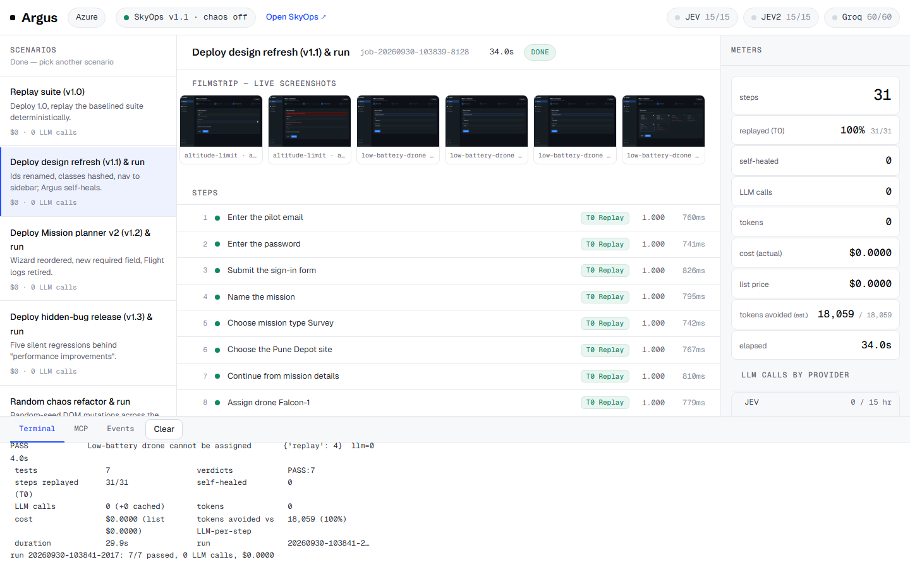
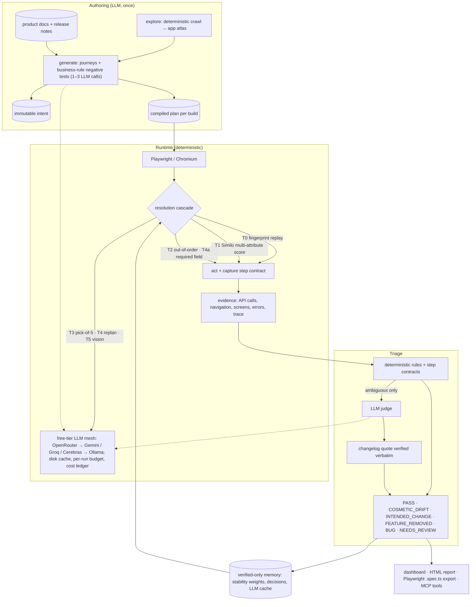
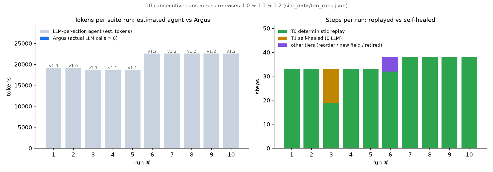
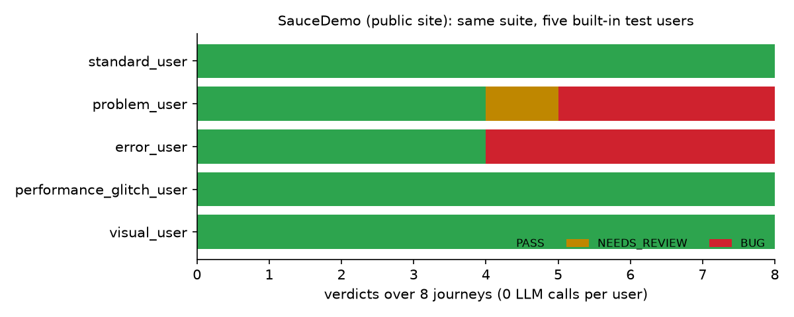
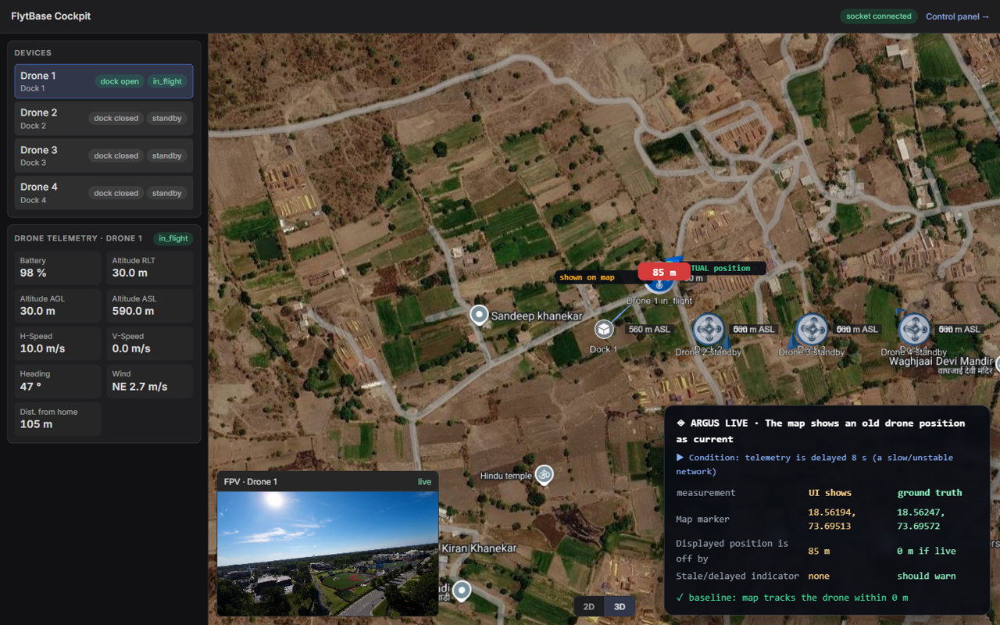
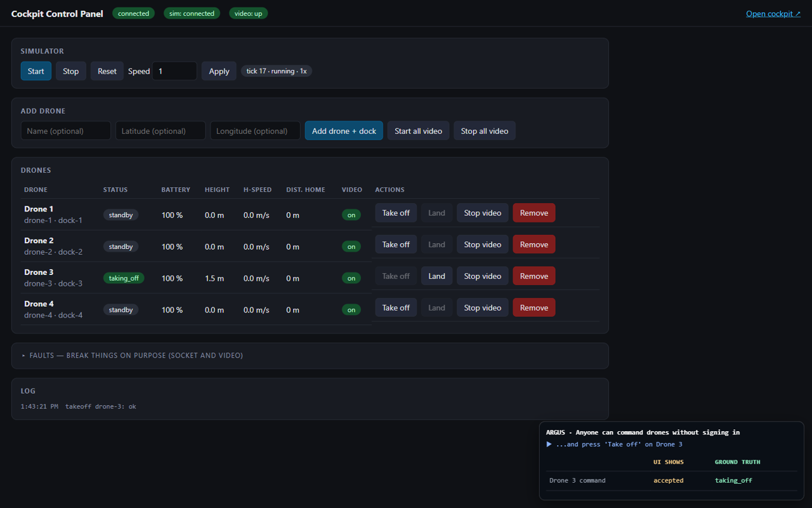
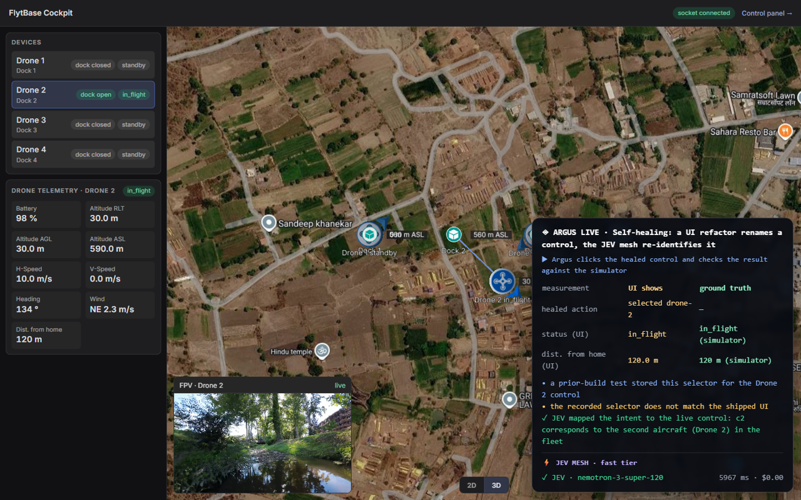
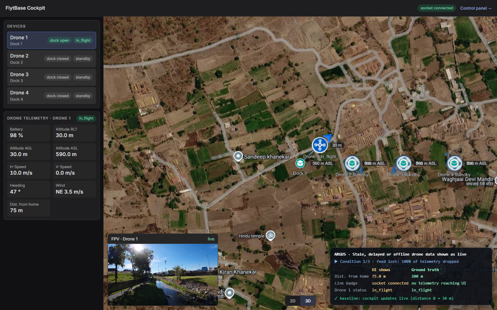

# Argus: the tireless hand in the browser

**Autonomous end-to-end UI testing that heals itself, remembers your app, can tell a bug from a feature,
and costs almost nothing to run.** Built solo for the AHC SWE Hackathon, *"The Tireless Hand"* (FlytBase).

> The LLM compiles. The runtime replays. Models are called only on *novelty*.

| | |
|---|---|
| 🌐 **Showcase site** (write-ups, recorded evidence, videos) | https://rajj28.github.io/argus-live/ |
| 🖥️ **Live console** (drive a real browser against the demo app) | Render free tier. One-click: [](https://render.com/deploy?repo=https://github.com/rajj28/argus) |
| 🎬 **Scenario videos** | [Level 1](https://rajj28.github.io/argus-live/level1.html) · [Level 2](https://rajj28.github.io/argus-live/level2.html) |
| 🧱 **Stack** | Python 3.11 · Playwright (Chromium, CDP) · FastAPI + SSE · Typer CLI · MCP server · OpenCV + imagehash · rapidfuzz · pydantic v2 · Docker / Caddy |

### Headline results (all from recorded runs in `site_data/`)

- **0 LLM calls in steady state.** Ten consecutive suite runs across three releases cost $0, against an
  estimated ~19–23k tokens *per run* for an agent that calls a model on every action.
- **100 % heal success, 0 % false alarms, 100 % bug recall (5/5)** on the offline gauntlet: 106 steps self-healed.
- **All 5 hidden regressions** in release v1.3 flagged as `BUG`/`REGRESSION`. Intended changes were accepted
  only with a release-note quote **verified verbatim**.
- On the live **FlytBase drone cockpit** it found a stale map (**85 m** gap between the drone shown and the real
  one), a frozen video still labelled "live", unauthenticated drone control and mobile layout occlusion. It also
  returned **PASS** on healthy flows, which shows it doesn't raise false alarms.



## System architecture



**Deployment (one container):** FastAPI console + job runner (SSE stream, one job at a time, rate-limited,
hourly LLM caps) → SkyOps A (the app under test) and SkyOps B (pinned to v1.3 for `diff`) on loopback.

## Why it's built this way

Most "AI testers" put a model in front of every click, so they're slow and expensive, and they drift on
the 10th run. Argus uses the model the way a compiler is used: once, to understand the app and write the
test. After that, every run is deterministic Playwright replay. The model comes back only when something
is genuinely new, and whatever it learns is written to memory, so the same situation costs **$0** next time.

---

## What it does (mapped to the judging criteria)

| Criterion | How Argus does it |
|---|---|
| **Reliability & self-healing** | Every target is a Similo-style *multi-attribute fingerprint* (role, accessible name, label, context row/card, neighbours, test-id, id, classes, xpath, position…). A **dual-view score** (what a script sees vs. what a human sees) re-identifies elements after refactors. Healing runs as a tiered cascade (below). Reordered flows are handled by **out-of-order execution** (0 LLM calls). |
| **Context & decision making** | A **triage engine** grounded in the product's business rules and release notes. It uses the NL-intent-as-oracle idea from *Testora* (ICSE 2026), adapted to UI testing. Deterministic rules come first; an LLM judge handles ambiguous cases, and its changelog citations are **verified verbatim** (anti-hallucination). The risk policy is asymmetric: without a citation, a change is never silently accepted. |
| **Cost & efficiency** | Steady-state runs make **0 LLM calls**. Each call is tiered (cheap → strong), cached on disk, budgeted per run and logged in a cost ledger. A **free-tier LLM mesh** puts JEV/OpenRouter first, then Gemini / Groq / Cerebras / local Ollama. Every report shows *tokens avoided vs. an LLM-per-action agent*. |
| **State memory & self-improvement** | `.argus/` is git-friendly JSON: versioned tests, app atlas, learned **attribute-stability weights** (e.g. "ids are unstable in this app" lowers their weight automatically), remembered human decisions, and an LLM cache. **Verified-only memory:** nothing is learned from a failed run. |
| **Test generation & maintenance** | `explore` crawls the app deterministically into an atlas. `generate` turns atlas + product context into journeys **and business-rule negative tests** in 1–3 LLM calls, then compiles and baselines them. Tests are auto-healed, auto-updated on intended changes (with a diff) and auto-retired when a feature is removed. They export as standard Playwright `.spec.ts` files. |

## Architecture

**Immutable intent vs per-build compiled plans.** A test's *intent* — name, goal, business oracles,
tags — is frozen the first time the test is saved (`.argus/tests/_intent/`) and can never be rewritten
by healing or adaptation. What the runtime mutates is the *compiled plan* (locators, step order,
expected effects), versioned per build under `.argus/tests/_plans/<build>/`. Evidence from a new build
is therefore always compared against a trusted baseline instead of a plan the previous release already
rewrote.

**The resolution cascade.** Each tier runs in order and stops as soon as it succeeds; only T3–T5 spend
tokens:

| Tier | What it does | Cost |
|---|---|---|
| T0 replay | the cached fingerprint still matches (score ≥ 0.90, same path) | $0 |
| T1 similarity | multi-attribute Similo-style score, clear winner (score/margin, identity) | $0 |
| T2 out-of-order | the flow was reordered: a later step's target is here → execute it now — never **across a commit point** (a step that wrote data on the baseline) | $0 |
| T4a required-field completion | a new required field blocks the flow → fill it with deterministic heuristics, press the progress button | $0 |
| T3 LLM heal | ambiguous: a small model picks among the top-5 candidates only | ~300 tokens |
| T4 replan | target gone (new required field / new screen): bounded LLM replan | ~2k tokens |
| T5 vision | VisualMark on canvas/map: **cached coords → template match → multiscale match → the VLM picks a numbered mark id** | VLM only |

Each step also carries a **falsifiable contract** captured automatically from the green run: the API
calls it makes (method, path, status class), where it navigates, and which screen appears. A mismatch
becomes evidence, with no model involved.

**Triage is rules-first.** Deterministic business rules and step contracts decide verdicts on their
own; the LLM judge only sees what's left, and every changelog citation it produces is **verified
verbatim** against the release notes before it is trusted. Without a citation a change is never
silently accepted. When there is **no changelog at all**, `argus diff` runs the same immutable intents
against two live instances and compares canonical behaviour traces — regressions vs refactor-only
drift. A test that cannot establish its starting state (session, data) is `PRECONDITION_FAILURE`, not
a bug.

**Free libraries:** `opencv-headless` and `imagehash` power the vision tier (template + multiscale
matching with a perceptual-hash cache); Playwright **tracing** keeps a debuggable trace of every
deviating run.

## Verified results on SkyOps (a drone-operations console, versions 1.0 → 1.3)

### 1. Offline Gauntlet (`argus gauntlet`, 0 LLM calls) — source: `.argus/gauntlet.json`

| Trials | Heal success | False alarms | Bug recall | Steps self-healed |
|---|---|---|---|---|
| 3 random refactor trials + 5 injected-bug trials | **100%** | **0%** | **100% (5/5)** | **106** |

### 2. Four-act demo, offline (`argus demo`, 0 LLM calls)

| Release | What changed | Argus verdicts | LLM calls |
|---|---|---|---|
| v1.0 | baseline | **8 PASS** | 0 |
| v1.1 | ids renamed, classes hashed, test-ids removed, nav → sidebar, labels reworded | **7 COSMETIC_DRIFT + 1 PASS** | 0 |
| v1.2 | wizard reordered, new required field, Flight logs retired | **3 INTENDED_CHANGE** (release-note quotes verified) **+ 1 FEATURE_REMOVED + 4 PASS** | 0 |
| v1.3 | "performance improvements" + 5 silent regressions | **5 BUG + 2 PASS (+1 retired)** | 0 |

### 3. `argus diff` — v1.0 vs v1.3 on two live instances, no changelog, no LLM

| What was compared | Evidence captured | Argus verdicts |
|---|---|---|
| Same immutable intents, two builds | lost side effects, a crash, a 500, business-rule violations | all **5 hidden bugs** flagged **REGRESSION** |
| Refactor-only flows | identical outcome and side effects; only how elements were found changed | **UI_DRIFT** |

`argus demo` and `argus gauntlet` reproduce those numbers; `benchmarks/ten_runs.py` replays the suite
10 times across 1.0 → 1.2 with the LLM off (steady-state cost curve, 0 LLM calls). The dashboard shows
the 10-run curve at `/tenruns` and any `argus diff` output at `/diff`.

### 4. Cost over ten consecutive runs



Run 3 is the v1.1 redesign: 14 steps self-heal at tier T1 with no model. Run 6 is the v1.2 release (reordered
wizard, new required field, a retired page), handled by the reorder, field and retire tiers. Every other run is
pure replay.

### 5. A public site it has never seen: SauceDemo



The same eight journeys ran against saucedemo.com's built-in test users with 0 LLM calls. The suite flags the
deliberately broken `problem_user` and `error_user` and passes `standard_user` and `performance_glitch_user`. It also
passes `visual_user`, whose defects are purely cosmetic: DOM-level oracles don't catch pixel-only glitches
(see Limits).

## Argus Live: testing a real-time drone cockpit (hackathon Levels 1 & 2)

The second half of the challenge was the **FlytBase cockpit**: a live drone-operations dashboard with a Cesium 3D
map, telemetry and WebRTC video, driven by a simulator. Here Argus checks every claim on screen against
**independent ground truth** from the simulator's control API. It reads the live Cesium entities through the React
fiber, converts them to lat/lon and measures the gap in metres.

| Stale map: UI shows an old position (85 m off) | Unauthenticated control: a stranger launches a drone |
|---|---|
|  |  |
| **Self-healing on a live UI refactor** | **Telemetry drop: is "live" still honest?** |
|  |  |

| Scenario | Verdict | Area |
|---|---|---|
| Signed-out visitor can command drones | **BUG** | security |
| Drone shown active while its data source is offline | **BUG** | telemetry freshness |
| Map shows an old drone position as current (85 m gap under an 8 s delay) | **BUG** | geospatial |
| Frozen video still labelled "live" (decoded-frame counter + perceptual hash) | **BUG** | video |
| Drone and dock labels overlap on the map | **BUG** | visual |
| Phone: video tile covers the map's 2D/3D switch | **BUG** | responsive |
| Movement trail matches the real flight path | PASS | geospatial |
| Selecting a drone switches map, video and telemetry together | PASS | functional |
| 16 drones flying for ~10 simulated minutes stay responsive (Long Tasks, click-to-paint, heap) | PASS | performance |

Full write-ups: [`LEVEL1_WRITEUP.md`](LEVEL1_WRITEUP.md) · [`LEVEL2_WRITEUP.md`](LEVEL2_WRITEUP.md) ·
[`EVALUATION.md`](EVALUATION.md). Narrated videos are on the [showcase site](https://rajj28.github.io/argus-live/).

## Quick start

```bash
pip install -e .            # installs the `argus` command
python -m playwright install chromium
argus doctor                # browser, app, LLM mesh, memory

# the showcase
python -m demo_app.server --port 8000        # SkyOps
argus init --url http://localhost:8000 --context demo_app/context --user pilot@skyops.io --password flysafe123
argus demo                  # four acts: baseline -> refactor -> redesign -> buggy release
argus dashboard             # Mission Control: evidence, diffs, learned memory, cost curve

# your own app
argus init --url https://your.app --context ./product-docs --user qa@you.com --password ...
argus explore && argus generate
argus run --label "PR #42"
argus export                # standard Playwright tests
```

### LLM mesh (all free tiers)

Put the keys in `.env`. They're read from the environment and never written anywhere else.

| Layer | Provider | Env var | Free key |
|---|---|---|---|
| 1 | JEV / OpenRouter | `JEV_API` or `OPENROUTER_API_KEY` | openrouter.ai/keys |
| 2 | Google Gemini | `GEMINI_API_KEY` | aistudio.google.com/apikey |
| 2 | Groq | `GROQ_API_KEY` | console.groq.com/keys |
| 2 | Cerebras | `CEREBRAS_API_KEY` | cloud.cerebras.ai |
| offline | Ollama (local) | — (auto-detected) | ollama.com |

`argus models` shows the live chains. Argus runs fine with **no** LLM at all: the deterministic core
covers replay, healing, reordering and rule-based bug detection.

### For coding agents (MCP)

```bash
claude mcp add argus -- argus mcp     # or any MCP client (opencode, Kiro, Cursor…)
```
Tools: `run_tests`, `verify_change(description)`, `explore_and_generate`, `last_report`.
The coding agent passes its intent, like a PR description. Argus tests the app in a real browser and
answers BUG / INTENDED_CHANGE with evidence. That closes the software-factory loop.

## Research it builds on
* Similo / VON Similo / VON Similo LLM: multi-attribute web element localization (Nass, Alégroth, Feldt; TOSEM 2023, STVR 2024)
* Hammoudi et al., *Why do record/replay tests of web applications break?* (ICST 2016): 73.6% of breakages are locators
* Pradel, *Testora: using natural-language intent to detect behavioral regressions* (ICSE 2026)
* FCPAgent: falsifiable commitment planning for web agents (2026), the basis for Argus's step contracts
* Budget-constrained study of skill/memory modules for web agents (2026): why Argus keeps memory verified-only
* AutoE2E: feature-driven E2E test generation (ICSE 2025)

## Deploy

| Where | How | Notes |
|---|---|---|
| **Render (free)** | Click *Deploy to Render* at the top (uses [`render.yaml`](render.yaml)) | One Docker web service. Tested locally under a **512 MB cap**, the free-tier limit: boot, bootstrap and a full real-Chromium run fit with no OOM. It sleeps when idle, so the first request takes ~1 min |
| **Any VM** | `deploy/docker-compose.yml` + Caddy (auto-TLS) | See [`deploy/README.md`](deploy/README.md); `provision_azure.sh` for Azure |
| **Local** | `docker build -f deploy/hf_space/Dockerfile -t argus . && docker run -p 7860:7860 argus` | Console on http://localhost:7860 |

LLM keys (`JEV_API`, `JEV2_API`, `GROK_API`) are optional environment variables. Every scenario marked
"0 LLM calls" works without them. Without keys, ambiguous behaviour changes are reported as `NEEDS_REVIEW`
instead of being judged.

## Limits

- DOM and behaviour oracles don't see pixel-only regressions (SauceDemo `visual_user` passes).
- Without an LLM, ambiguous behaviour changes go to a human (`NEEDS_REVIEW`) rather than being judged automatically.
- The live-cockpit probes (Cesium via React fiber) are specific to that stack. The core cascade is app-agnostic.

## Repository layout

```
argus/        browser/ healing/ runner/ triage/ memory/ llm/ vision/ live/ web/ · mcp_server.py · cli.py
demo_app/     SkyOps, the drone-ops app under test (versions 1.0 → 1.3, chaos mode)
exam_app/     a second app (clinic booking) for zero-knowledge generation tests
benchmarks/   ten_runs · realworld_saucedemo · exam · llm_path
site_data/    exported results behind the dashboard and the README charts
site/         the GitHub Pages showcase (Level 1/2, architecture)
deploy/       Docker, Caddy, compose, Azure, Render / HF variants
docs/         SPEC, DESIGN, architecture page, README images
tests/        pytest suite (no network, no LLM)
```

README charts and thumbnails: `python scripts/make_readme_assets.py` (reads `site_data/*.json`).
